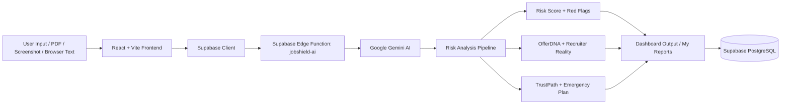

<div align="center">

# JobShield

### AI-Powered Job Scam & Fake Offer Detector

Protecting job seekers from fraudulent job offers, fake HR recruiters, identity theft, and employment scams using real-time multimodal AI analysis.

[](#license)
[](#quick-start)
[](#prerequisites)
[](#contributing)
[](#)

[Features](#key-features) • [Tech Stack](#tech-stack) • [Quick Start](#quick-start) • [Architecture](#architecture--workflow) • [Contributing](#contributing)

</div>

---

## Overview

**JobShield** is a full-stack AI safety platform for job seekers. It helps users verify suspicious job offers, recruiter messages, PDFs, screenshots, and hiring claims before they trust, pay, or share personal documents.

The app combines rule-based scam detection, Gemini-powered analysis, Supabase persistence, community scam intelligence, a desktop browser copilot extension, and guided emergency response workflows.

> **Security callout:** Gemini API keys must stay in Supabase Edge Function secrets. Do not place private AI keys in frontend `.env` files or browser extension code.

## Key Features

- **Smart Offer Letter Parser**
  Upload or paste job offer content from PDFs, screenshots, documents, or messages. JobShield extracts readable text and checks for fake hiring patterns, suspicious wording, payment clauses, unrealistic offers, and risky document requests.

- **Domain & Recruiter Verification**
  Flags free email recruiters, private WhatsApp/Telegram pressure, weak company identity, missing company proof, and recruiter impersonation signals. Recruiter Reality Check helps users decide whether the recruiter truly represents the claimed company.

- **Scam Radar & Risk Score**
  Generates a clear 0-100 risk score with risk level, red flags, evidence snippets, scam fingerprint, community alerts, and a user-friendly safety action plan.

- **OfferDNA**
  Breaks an offer into explainable risk dimensions such as salary realism, role clarity, contract terms, payment demand, interview authenticity, and document safety.

- **TrustPath Timeline**
  Visualizes the full scam journey: first contact, recruiter identity, offer proof, money request, document safety, and final decision. It shows exactly where the opportunity becomes unsafe.

- **Emergency Loss Mode**
  Interactive response flow for users who already paid money, shared documents, shared OTPs/passwords, or installed an unknown app. Includes 1930, cybercrime.gov.in, bank action steps, and evidence checklists.

- **Real-Time Browser Guard**
  Desktop browser extension prototype that scans suspicious job-related content on websites such as Gmail, LinkedIn, WhatsApp Web, Telegram Web, and job portals.

- **Anonymous + Logged-In Reports**
  Users can scan without login. Anonymous reports are linked to a local anonymous session and can be claimed after login.

## Architecture & Workflow



### Data Flow

1. User pastes text, uploads a file, or sends text from Browser Copilot.
2. Frontend prepares the scan and invokes the Supabase Edge Function.
3. Gemini performs structured AI analysis through the backend only.
4. JobShield enriches the result with local scam rules, OfferDNA, recruiter checks, TrustPath, and action plans.
5. Scan reports are stored in Supabase and displayed in Results, Dashboard, My Reports, and Scam Radar.

## Tech Stack

| Layer | Technology |
| --- | --- |
| Frontend | React 18, Vite, Tailwind CSS, React Router |
| UI & Visualization | Radix UI, Lucide React, Framer Motion, Recharts |
| Backend | Supabase Database, Auth, Storage, Edge Functions |
| Database | PostgreSQL with Row Level Security policies |
| AI/ML | Google Gemini API through Supabase Edge Function |
| Browser Guard | Manifest V3 extension, content script, background worker, popup UI |
| Reports | jsPDF, html2canvas |
| Hosting | Vercel frontend + Supabase backend |

## Quick Start

### Prerequisites

- Node.js 18+
- npm
- Git
- Supabase project
- Google Gemini API key
- Supabase CLI, for Edge Function deployment

### Local Setup

```bash
git clone https://github.com/Pranay207/JobShield-AI.git
cd JobShield-AI
npm install
```

Create a local environment file:

```bash
cp .env.example .env
```

Fill in your Supabase frontend values:

```env
VITE_SUPABASE_URL=https://your-project-ref.supabase.co
VITE_SUPABASE_ANON_KEY=your_supabase_anon_key
```

Run locally:

```bash
npm run dev
```

Open the app:

```txt
http://127.0.0.1:5173
```

### Production Build

```bash
npm run lint
npm run typecheck
npm run build
```

## Environment Variables

Create `.env` in the project root:

```env
VITE_SUPABASE_URL=https://your-project-ref.supabase.co
VITE_SUPABASE_ANON_KEY=your_supabase_anon_key
```

Supabase Edge Function secrets:

```bash
npx supabase secrets set GEMINI_API_KEY=your_gemini_api_key --project-ref your_project_ref
npx supabase secrets set GEMINI_MODEL=gemini-3.5-flash --project-ref your_project_ref
npx supabase secrets set SLACK_WEBHOOK_URL=https://hooks.slack.com/services/your/webhook/url --project-ref your_project_ref
```

> **Important:** `VITE_*` variables are exposed to the browser. Only put public frontend values there. Keep Gemini and other private service keys in Supabase Secrets.

## Supabase Setup

Run the schema in Supabase SQL Editor:

```txt
supabase/schema.sql
```

Deploy the AI Edge Function:

```bash
npx supabase functions deploy jobshield-ai --project-ref your_project_ref
npx supabase functions deploy jobshield-alerts --project-ref your_project_ref
```

On Windows, if Supabase CLI has certificate issues, run:

```powershell
$env:NODE_OPTIONS="--use-system-ca"
npx supabase functions deploy jobshield-ai --project-ref your_project_ref
npx supabase functions deploy jobshield-alerts --project-ref your_project_ref
```

## Browser Copilot Extension

The desktop browser extension is located at:

```txt
extension/jobshield-copilot
```

Load it in Chrome or Microsoft Edge:

1. Open `chrome://extensions` or `edge://extensions`.
2. Enable **Developer mode**.
3. Click **Load unpacked**.
4. Select `extension/jobshield-copilot`.
5. Open Gmail, LinkedIn, WhatsApp Web, Telegram Web, or a job portal and test suspicious job content.

> Browser Copilot is desktop-browser based. On mobile, users can scan through the JobShield web app by pasting messages or uploading screenshots/PDFs.

## Slack Alerts

JobShield can notify a community moderation team whenever a high-risk community scam report is submitted. The Slack webhook is stored as a Supabase secret and is never exposed in frontend code.

Configure the secret:

```bash
npx supabase secrets set SLACK_WEBHOOK_URL=https://hooks.slack.com/services/your/webhook/url --project-ref your_project_ref
```

Deploy the alert function:

```bash
npx supabase functions deploy jobshield-alerts --project-ref your_project_ref
```

A report is treated as high risk when it includes a payment amount, high-risk scam type, or risky text signals such as OTP, Aadhaar/PAN, UPI, bank details, refundable deposit, registration fee, or WhatsApp/Telegram pressure.

## Deployment

Recommended deployment:

| Service | Purpose |
| --- | --- |
| Vercel | Frontend hosting |
| Supabase | Database, Auth, Storage, Edge Functions |

Vercel settings:

```txt
Framework: Vite
Build Command: npm run build
Output Directory: dist
```

Required Vercel environment variables:

```env
VITE_SUPABASE_URL=https://your-project-ref.supabase.co
VITE_SUPABASE_ANON_KEY=your_supabase_anon_key
```

The included `vercel.json` rewrites all routes to `index.html` so React Router works on refresh and direct mobile links.

## Roadmap

- [x] AI job offer analysis
- [x] PDF, screenshot, and text scan flow
- [x] Risk score and red flag explanation
- [x] OfferDNA contract-risk parser
- [x] Recruiter Reality Check
- [x] Scam Radar and community reports
- [x] TrustPath Timeline
- [x] Emergency Loss Mode
- [x] Desktop Browser Copilot prototype
- [ ] Audio/voice interview scam detector
- [ ] Deepfake HR interview detection
- [ ] Official company registry and GST/CIN verification APIs
- [ ] WhatsApp/Telegram share-to-scan workflow
- [ ] Advanced multilingual OCR for Indian languages
- [ ] Crowdsourced verified scam database
- [ ] Mobile app with share sheet integration
- [ ] Admin moderation dashboard

## Contributing

Contributions are welcome. If you want to improve JobShield:

1. Fork the repository.
2. Create a feature branch.
3. Make your changes with clear commits.
4. Run validation locally.
5. Open a pull request with a concise description and screenshots if UI changed.

```bash
npm run lint
npm run typecheck
npm run build
```

Please avoid committing secrets, API keys, generated `dist/` files, or local `.env` files.

## License

This project is released under the **MIT License**.

## Acknowledgements

Built as a hackathon project to make digital hiring safer for students, freshers, and job seekers.

<div align="center">

**Verify before you trust. Protect before you pay.**

</div>